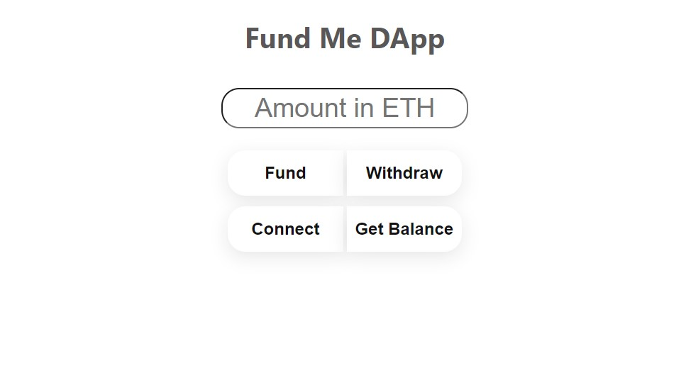

# [Fund Me DApp]()

## Screenshot

## Pre-requisite
- [__Metamask__](https://metamask.io/) wallet extension for browser with **Rinkeby** testnet ethers
   

## About Contract

 * **Title**: A Funding Contract
 * **Author**: Subroto Kumar
 * **Smart Contract Source Code**: [@subrotokumar/hardhat-fundme](https://github.com/subrotokumar/hardhat-fundme)
 * Contract deployed at: [0x8bd3025776Ae62676d5B98a33FAfcb9d2710a1BE](https://rinkeby.etherscan.io/address/0x8bd3025776Ae62676d5B98a33FAfcb9d2710a1BE#code)